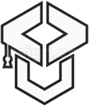

# CoderPort 🌐

Welcome to the official website repository for **CoderPort**, a non-profit organization that empowers developers to dock, build, and innovate together.

---

## 🌟 About CoderPort

CoderPort is a community-driven initiative to support developers of all skill levels. We offer resources, events, and tools to help coders grow, collaborate, and stay productive.

This website serves as our main landing page to showcase what we do, how to get involved, our featured projects, and ways to support us.

---

## 🔧 Tech Stack

- HTML5 & CSS3
- JavaScript (for responsive mobile nav)
- Google Fonts (Poppins)
- Font Awesome Icons
- Responsive design with mobile support

---

## 🚀 Sections Included

- **Navigation Bar** – Sticky top bar with responsive mobile hamburger menu
- **About Us** – Quick overview of our mission and goals
- **Why Join?** – Visual section highlighting community benefits
- **Current Projects** – Overview of projects like DevTick and Flask Template
- **How to Join** – Easy access to all platforms (Email, Discord, GitHub, etc.)
- **Donate** – Embedded PayPal donation button
- **Footer** – Social icons and copyright

---

## 💡 Featured Projects

### 🛠️ DevTick

A productivity tool for developers including:
- Task tracking
- Project organization
- Contact book
- API key manager
- Project idea vault
- Built-in AI assistant

[🔗 View on GitHub](https://github.com/SarveshwarSenthilKumar/DevTick)

---

### 🧩 Flask Development Template

A starter template for developers building scalable Flask apps.
- Authentication
- SQLite integration
- Organized folder structure

[🔗 View on GitHub](https://github.com/SarveshwarSenthilKumar/Flask-Development-Template)

---

## 🙌 Contributing

Pull requests are welcome! For major changes, please open an issue first to discuss what you would like to change.

---

## 💖 Support Us

If you'd like to support CoderPort’s mission, consider donating through PayPal.

---

## 📬 Contact

- 📧 [Email Us](mailto:officialcoderport@gmail.com)
- 🗨️ [Join Our Discord](https://discord.gg/QhupTjUf)
- 🧑‍💻 [Follow us on GitHub](https://github.com/CoderPort)
- 📸 [Instagram](https://www.instagram.com/coderport_social/)
- 🎵 [TikTok](https://www.tiktok.com/@coderport)
- 🐦 [X / Twitter](https://x.com/CoderPortOrg)

---

_Created with ❤️ by the CoderPort Team_
